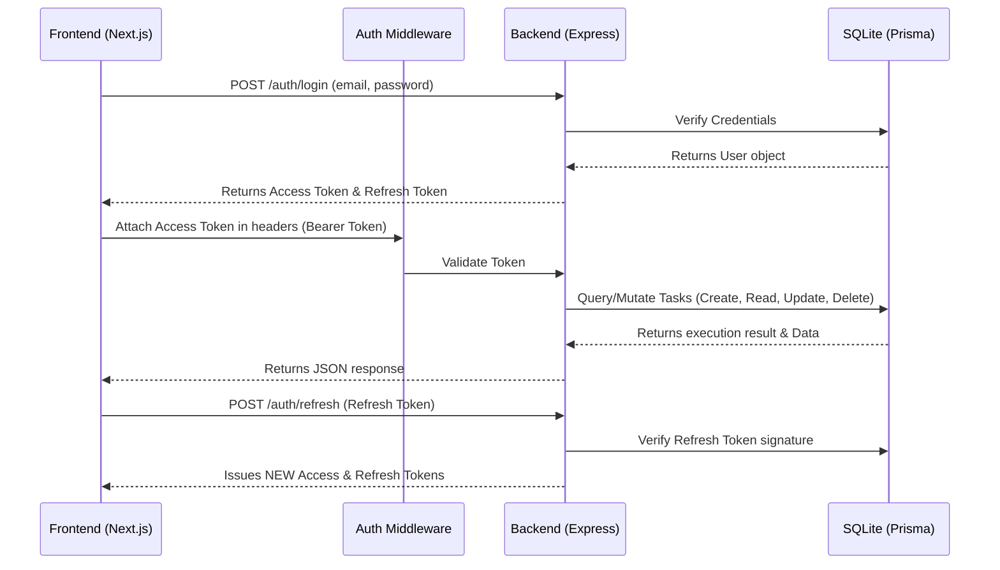

# Task Management System

A full-stack task management application that allows users to seamlessly register, log in, and manage their daily tasks. The system features a secure Node.js & Prisma backend linked with a responsive, modern Next.js frontend boasting a beautiful glassmorphism aesthetic.

## 🚀 Features

### **Backend (Node.js API)**
- **Authentication**: JWT-based Secure Login & Registration with Access (15m) and Refresh Tokens (7d).
- **Password Security**: Bcrypt password hashing.
- **Task Management CRUD**: Create, Read, Update, Delete your own personal tasks.
- **Advanced Querying**: Pagination, filtering by status (PENDING, IN_PROGRESS, COMPLETED), and searching by title.
- **Robust Validation**: Zod schema validation for strict type-safe APIs.
- **Database**: SQLite powered smoothly by Prisma ORM.

### **Frontend (Next.js)**
- **Modern UI**: Fully responsive Dashboard in Dark Mode with custom Glassmorphism cards.
- **State Management**: React Context API for Global Authentication and Toast Notifications.
- **Optimistic UI Updates**: Instant toggling of task states for a snappier UX.
- **Smart Searching**: Debounced task search integrated directly with the backend API.
- **Form Handling**: A unified Modal System for creating and editing tasks.

---

## 🏗️ Architecture & Data Flow

The project follows a decoupled client-server architecture where the Next.js React frontend communicates with the Express.js API via RESTful endpoints.



---

## 📂 Folder Structure

The project code is distinctively split into two separate workspaces: `frontend` and `backend`.

```text
taskManagement/
├── backend/                        # Express API server powered by Prisma
│   ├── prisma/                     # Database schemas and local development instances
│   │   ├── schema.prisma           # Prisma Data Model Declarations
│   │   └── dev.db                  # Local SQLite Database
│   ├── src/                        # Source Code
│   │   ├── middleware/             # Express middlewares (Auth, Validation)
│   │   ├── routes/                 # API controllers and routing logic
│   │   │   ├── auth.ts             # Authentication endpoints
│   │   │   └── tasks.ts            # CRUD endpoints for tasks
│   │   ├── utils/                  # Helper functions (JWT Generator)
│   │   └── index.ts                # Server entry point
│   ├── .env                        # Backend environment variables
│   └── package.json                # Server dependencies & scripts
│
└── frontend/                       # Next.js web application
    ├── app/                        # Next.js App Router Pages
    │   ├── dashboard/              # Task listing and management interface
    │   ├── login/                  # User login
    │   ├── register/               # New user creation
    │   ├── layout.tsx              # Global layout and Context Providers
    │   └── page.tsx                # Landing Page
    ├── components/                 # Reusable UI elements
    │   └── TaskForm.tsx            # Form modal for both Creating and Editing tasks
    ├── context/                    # Global React Contexts
    │   ├── AuthContext.tsx         # User session & API Tokens management
    │   └── ToastContext.tsx        # Global Notification system
    ├── lib/                        # Helper libraries
    │   └── api.ts                  # Axios interceptors for automated Refresh Tokens handling
    ├── public/                     # Static assets
    ├── .env.local                  # Frontend environment variables
    ├── index.css                   # Global styles & Glassmorphism variables
    ├── tailwind.config.ts          # TailwindCSS configuration
    └── package.json                # Client dependencies & scripts
```

---

## 🛠️ Technology Stack

| Technology | Role |
| :--- | :--- |
| **Node.js + Express** | Backend Server handling REST API logic and routing |
| **TypeScript**| Strictly typed Javascript utilized across the entire stack |
| **Prisma ORM** | Object Relational Mapper for safe SQL executions |
| **SQLite** | Local Database storage |
| **Next.js 14** | Client Web framework (Using App Router) |
| **TailwindCSS** | Utility classes utilized for styling components rapidly  |
| **Zod** | Schema declarations explicitly used for API request validations |
| **Axios**| Robust HTTP client bridging requests to the backend server with interceptors |
| **JSON Web Token**| Secures APIs endpoints verifying validity |

---

## 🚦 Getting Started

Follow these steps to run the complete stack locally.

### 1. Backend Setup

```bash
# Navigate to the backend directory
cd backend

# Install dependencies
npm install

# Apply database schemas / Initialize Database
npm run prisma:migrate -- --name init

# Start the Node.js Development Server (runs on Port 5001)
npm run dev
```

### 2. Frontend Setup

```bash
# Open a NEW terminal instance, navigate to frontend directory
cd frontend

# Install dependencies
npm install

# Start the Next.js Development Server (runs on Port 3000)
npm run dev
```

### 3. Open Application

Visit `http://localhost:3000` in your web browser. You can register an account, log in with it, and immediately start creating tasks.

---

> Built as part of the Full-Stack Engineer assessment path.
